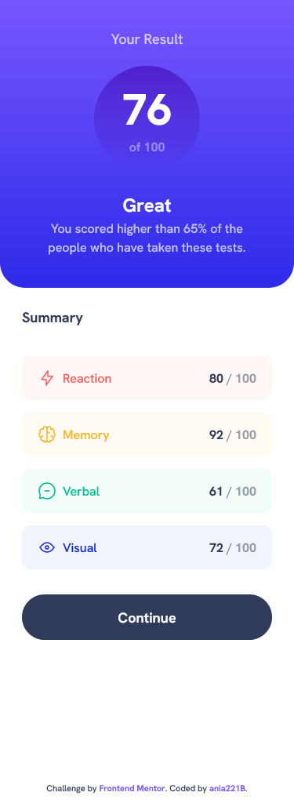
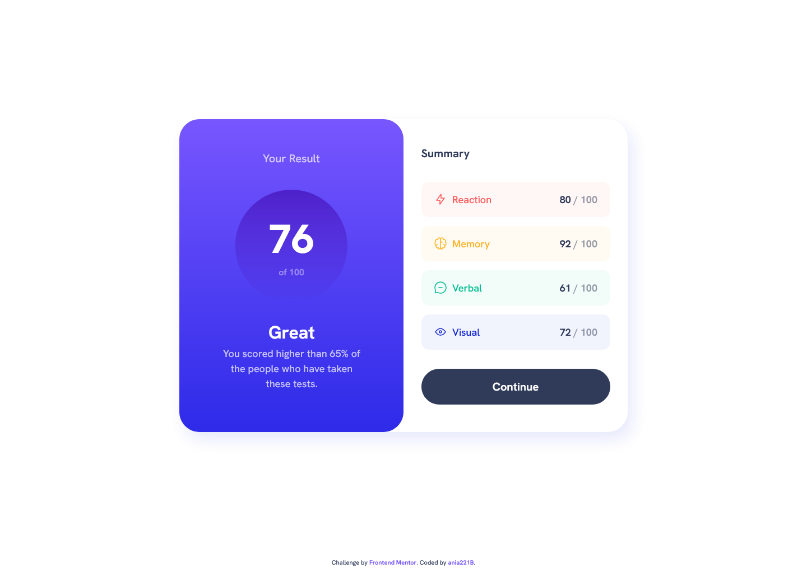

# Frontend Mentor - Results summary component solution

This is a solution to the [Results summary component challenge on Frontend Mentor](https://www.frontendmentor.io/challenges/results-summary-component-CE_K6s0maV). Frontend Mentor challenges help you improve your coding skills by building realistic projects.

## Table of contents

- [Overview](#overview)
  - [The challenge](#the-challenge)
  - [Screenshot](#screenshot)
  - [Links](#links)
- [My process](#my-process)
  - [Built with](#built-with)
  - [What I learned](#what-i-learned)
  - [Continued development](#continued-development)
  - [Useful resources](#useful-resources)
- [Author](#author)
- [Acknowledgments](#acknowledgments)

## Overview

### The challenge

Users should be able to:

- View the optimal layout for the interface depending on their device's screen size
- See hover and focus states for all interactive elements on the page

### Screenshot




### Links

- Solution URL: [GitHub](https://github.com/ania221B/results-summary-frontend-mentor)
- Live Site URL: [GitHub Pages](https://ania221b.github.io/results-summary-frontend-mentor/)

## My process

### Built with

- Semantic HTML5 markup
- CSS custom properties
- Flexbox
- CSS Grid
- Mobile-first workflow
- Vanilla JavaScript
- fetch()
- local JSON file

### What I learned

- Getting data from a local JSON file:

Turns out all you need to do is provide the path to local JSON file instead of the resource URL in `fetch()` method:

```javascript
const url = 'js/data.json'
fetch(url).then(data => {
  // code for handling the data
})
```

or

```javascript
fetch('js/data.json').then(data => {
  // code for handling the data
})
```

Your JSON file needs to be on a server for this to work, though.

### Continued development

- working with `fetch()`
- working with `JSON` format
- writing CSS that's not that bloated...

### Useful resources

- [How to Read a JSON File in JavaScript – Reading JSON in JS](https://www.freecodecamp.org/news/how-to-read-json-file-in-javascript/) - From this article I've learnt how to get data from a local JSON file.

## Author

- Frontend Mentor - [@ania221B](https://www.frontendmentor.io/profile/ania221B)

## Acknowledgments

The idea for the animations came from this CodePen:
[Increase Number Animation](https://codepen.io/duvander/pen/KXOpXw)
